# Nama : Manda Agustriya,
Asal Kampus : Universitas Malikussaleh,
Alamat :Ranto Peureulak, Aceh Timur,
Prodi : Teknik Informatika,
Semester : 5.

-penjelasan

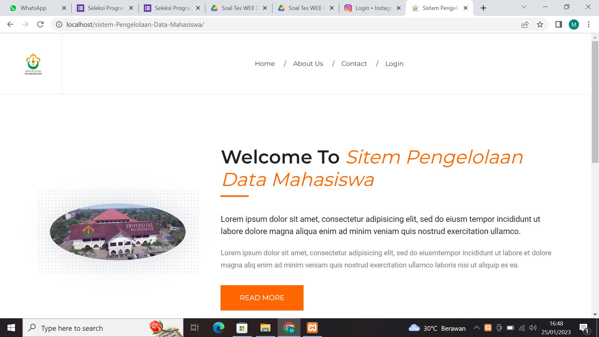
Gambar diatas merupakan halaman landing page / home pada tampilan awal saat web dibuka. Dihalaman bagian atas terdapat menu home, about us, contact dan halaman login.
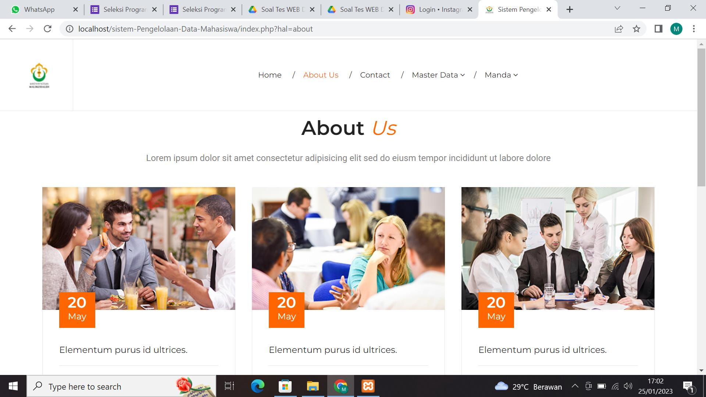
Gambar diatas gambaran halaman About Us.
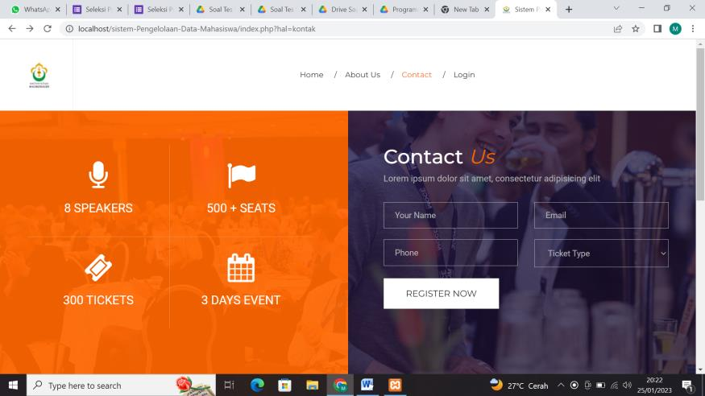
Gambar diatas merupakan halaman contact .
 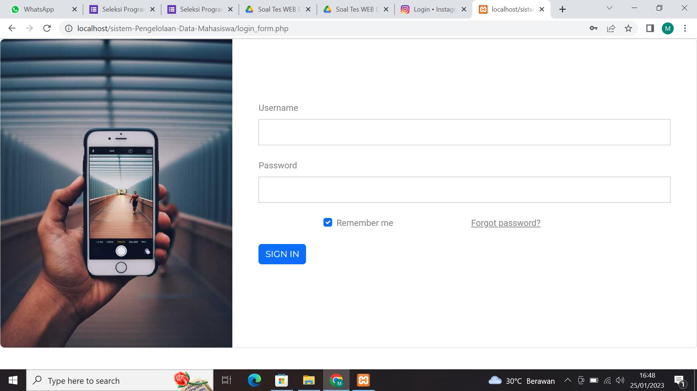
Gambar diatas tersebut merupakan halaman login yang dimana mempunyai username dan password yang hanya diperoleh untuk admin dan staff saja, disini saya membuat username nya “admin” dan passwordnya “password”.  
 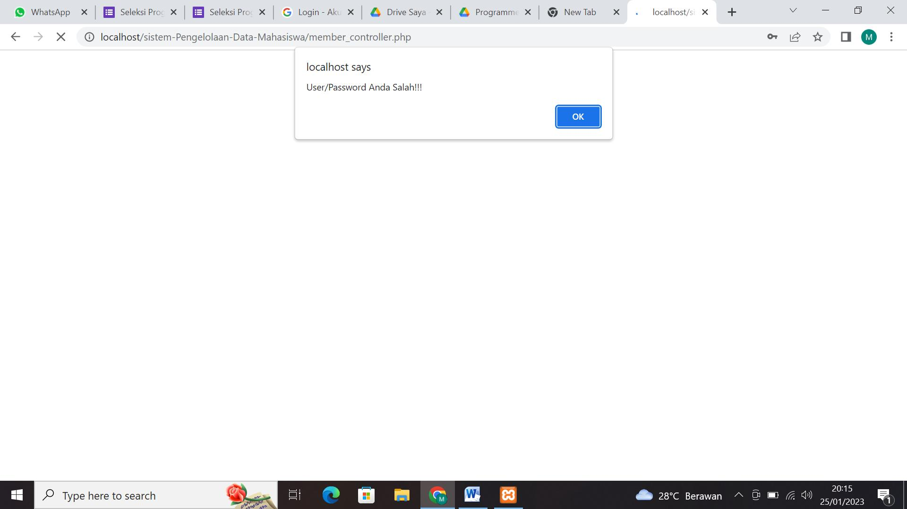
Jika password atau username salah makan akan keluar pemberitahuan “User/Password Anda Salah!!
 
Dan jika username dan password sudah benar saat dimasukkan maka akan muncul halaman admin yang mana terdapat nama dari admin dibagian atas kanan, dan terdapat daftar mahasiswa beserta beberapa fitur, menambah, melihat detail, mengedit, dan menghapus.
 
Pada menu master data terdapat pilihan yang akan menuju kepada halaman daftar mahasiswa, daftar prodi, dan daftar semester.
 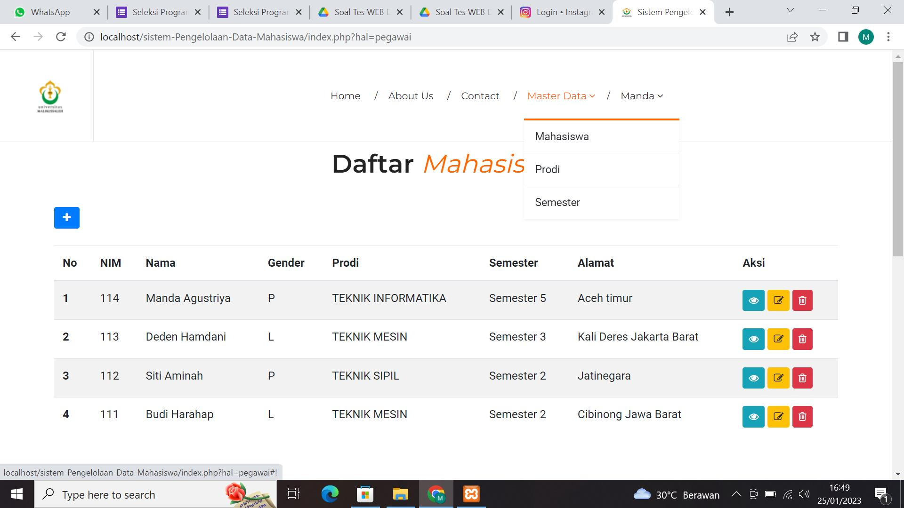
Daftar Mahasiswa
	 
 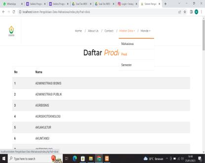
Daftar Prodi
	 
 
Daftar Semester

  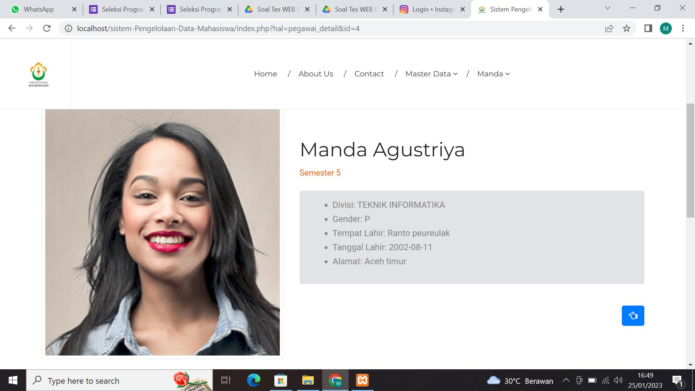
Gambar diatas merupakan halaman detail yang dapat di lihat dari daftar mahasiswa.
  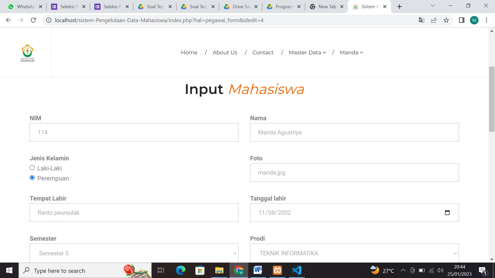
Ini merupakan halaman edit data mahasiswa yang dapat di lihat pada fitur yang ada di daftar mahasiswa.
  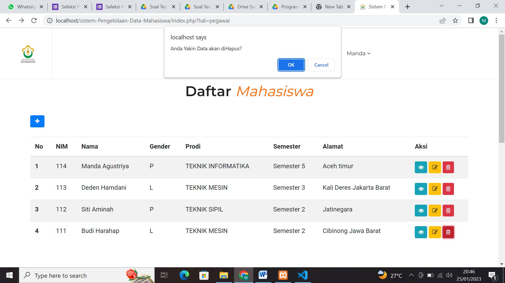
Dan ini merupakan fitur hapus yang mana saat menekan fitur hapus akan mengeluarkan kata “ Anda yakin data akan dihapus” jika ingin menghapusnya secara permanen maka tekan OK dan data pun berhasil  terhapus.
  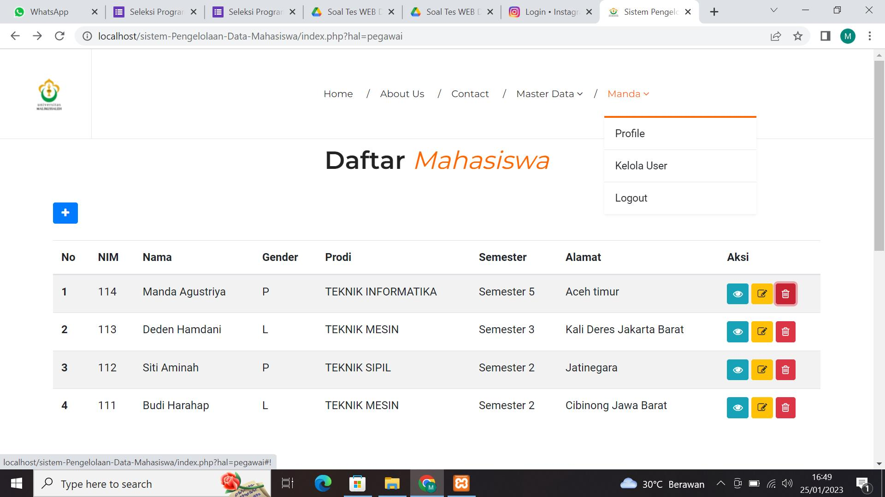
Selanjutnya dibagian admin terdapat fitur profile, kelola user, dan logout jika ingin keluar dari fitur admin.

SELESAI.
